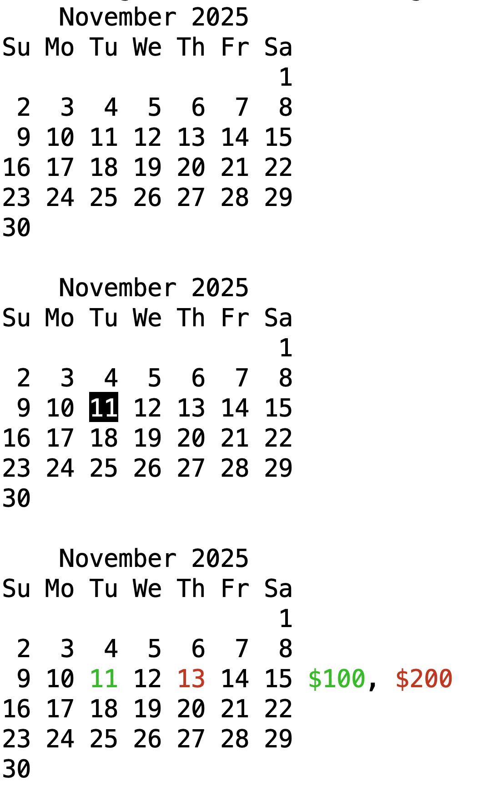
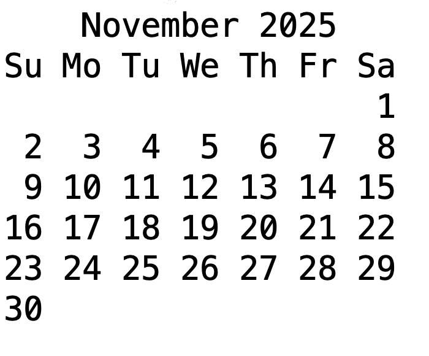
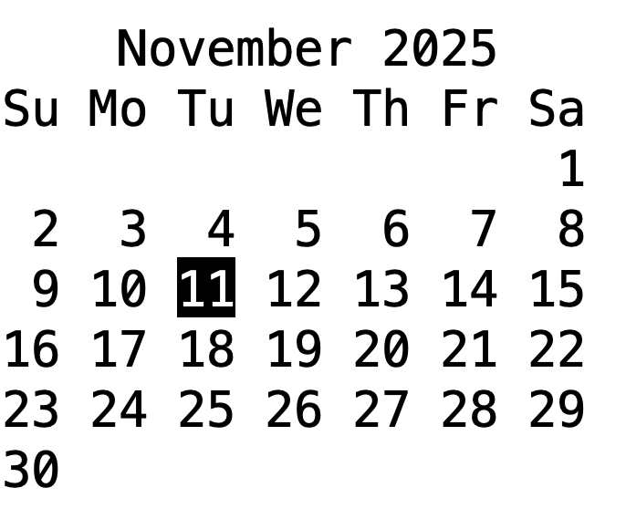

# go-textcal

This Go package creates ASCII calendars for terminals, similar to
the `cal` Unix command line utility.

On top of that, it allows coloring of selected days, as well as annotations
on the right, referring to marked days on the left.

Formatters are just generic functions receiving a string and returning
a formatted string, but usually employ `github.com/fatih/color` to
color letters in ANSIColors.



## Basic Example
```
package main

import (
	"github.com/mschilli/go-textcal"
	"fmt"
	"time"
)

func main() {
	textcal := textcal.New(time.Now())
	fmt.PrintLn(textcal.String())
}
```



## Mark specific day(s)
```
package main

import (
	"github.com/mschilli/go-textcal"
	"fmt"
	"time"
)

func main() {
	month := time.Date(2025, time.November, 1, 0, 0, 0, 0, time.UTC)
	cal := textcal.New(month)

	cal.UseFormatter(11, cal.ReverseFormatter())
	fmt.Println(cal.String())
}
```



## Color days and add annotations
```
package main

import (
	"fmt"
	"time"
	"github.com/mschilli/go-textcal"
	"github.com/fatih/color"
)

func main() {
	month := time.Date(2025, time.November, 1, 0, 0, 0, 0, time.UTC)
	cal := textcal.New(month)

	makegreen := cal.ColorFormatter(color.FgGreen, color.Reset)
	makered := cal.ColorFormatter(color.FgRed, color.Reset)

	cal.UseFormatter(11, makegreen)
	cal.Annotate(11, makegreen("$100"))

	cal.UseFormatter(13, makered)
	cal.Annotate(13, makered("$200"))

	fmt.Println(cal.String())
}
```


## Author

Mike Schilli, m@perlmeister.com 2025

## License

Released under the [Apache 2.0](LICENSE)
